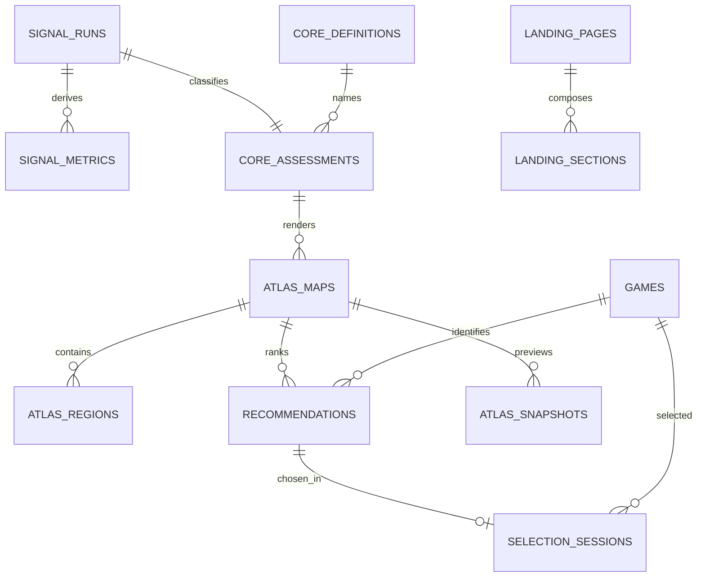

# NEXT SAVE mock domain database blueprint

> **Day 8 design only.** No SQL in this document has been applied to
> Supabase or another external database. All profile-shaped records are
> fictional fixtures.

## Persistence decision

The product-wide model is drawn now so later work has explicit boundaries, but
the first executable write slice remains deliberately small:

```text
selection_sessions
├─ id                  uuid, PK, generated
├─ fixture_profile_key text, NOT NULL
├─ recommendation_id   uuid, FK → recommendations.id
├─ selected_game_id    uuid, FK → games.id
└─ created_at          timestamptz, NOT NULL
```

It records only which public/fixture game a fictional demo profile selected.
It does not record an entered profile URL, private library, account identity,
cookie, secret, raw play history, device data, or live social activity.

## Relationship overview



`COM`, `SNP`, `UXS`, and `REV` are not promoted into active product features:

- `COM` stores only a disabled capability ledger in the conceptual design.
- `SNP` is a static fixture preview; sharing/export tables are absent.
- `UXS` versions disclosure and accessibility contracts, not user behavior.
- `REV` has `persistence: none` until the B1 product decision and separate
  account/billing/privacy approvals.

## Domain ledger

| Code | Domain | Status | Mock source of truth | Explicitly absent |
|---|---|---|---|---|
| SIG | Taste signals | core | `signal_runs`, `signal_metrics` | real player ingestion |
| ARC | Soft core | core | `core_definitions`, `core_assessments` | scientific identity claim |
| MAP | Taste atlas | core | `atlas_maps`, `atlas_regions` | copied private library |
| PIC | Next picks | core | `recommendations`, `selection_sessions` | untraceable recommendation text |
| LND | Landing content | preview | `landing_pages`, `landing_sections` | form-input persistence |
| GME | Game catalogue | core | `games`, `game_genres` | personal interpretation |
| COM | Archetype community | deferred | `community_capabilities` | accounts, follows, feed, UGC |
| SNP | Atlas snapshot | preview | `atlas_snapshots` | share links, exports, analytics |
| UXS | Experience contract | preview | `experience_contracts` | behavioral telemetry |
| REV | Revenue | deferred | none | prices, plans, transactions |

## Integrity notes

- A ready recommendation set must contain ranks `{1, 2, 3}` exactly once.
  A row-level check cannot prove the set-level count; a future migration must
  use a transaction or deferred constraint trigger before marking it ready.
- Every recommendation stores named `signal_refs` that resolve to its fixture
  signal run.
- `strength_pct` is used for ARC because statistical confidence has not been
  defined. Existing UI copy that says confidence is a product-language issue,
  not permission to invent model certainty.
- The upstream ledger drifts between S1–S4 and S1–S5. The mock permits S1–S5
  and records this as unresolved rather than deleting the fifth signal.
- Final core names and a possible five-to-six-core split remain unresolved.

## Fixture example

```text
signal_runs:        steady-explorer / fixture / v1
signal_metrics:     story-return, long-session
core_assessments:   world-explorer / strength 86
atlas_maps:         atlas-steady-v1
recommendations:    hollow-knight / rank 1 / [story-return, long-session]
selection_sessions: generated uuid / steady-explorer / hollow-knight
```

The example is explanatory data, not a seeded external database.
